<!--
  ☕ this README is brewed automatically by scripts/build.mjs
  edit README.template.md + profile.config.json instead of this file
-->

<div align="center">

<picture>
  <source media="(max-width: 700px)" srcset="https://raw.githubusercontent.com/Abudora-0/Abudora-0/main/assets/header-mobile.svg">
  
</picture>

<br>

<a href="https://abudora.netlify.app/"></a> <a href="https://www.linkedin.com/in/m-abdullah-94367b3a1/"></a> <a href="mailto:m.abdullah21306@gmail.com"></a> <a href="https://x.com/Abudora0"></a> <a href="https://instagram.com/abudora0"></a>

<br>

<sub><i>✨ 35° and clear skies over lahore right now, a good time for deep work</i></sub>

</div>


### ☕ &nbsp;pull up a chair

hey, i'm **m. abdullah**, though most of the internet knows me as **abudora**. i'm a computer science student at **uet lahore** and a **full stack developer** who builds cozy, fast and mostly **local-first** things for the web and the desktop.

i like software that feels calm to use: no accounts you didn't ask for, no telemetry, no surprise cloud bill. the data stays on the box it was made on, and the interface still holds up on a slow connection.

<details>
<summary><b>🍪 &nbsp;a few more things about me</b> <sub>(click to open the cookie jar)</sub></summary>
<br>

```text
~/abudora $ cat about.txt

  building    ▸ full stack apps with next.js, react & typescript
              ▸ desktop tools with tauri + rust
              ▸ local ai & rag pipelines with ollama

  learning    ▸ advanced data structures & algorithms
              ▸ database internals: indexes, query plans, locking
              ▸ caching layers & background job queues
              ▸ system design & production observability

  off hours   ▸ a manga backlog that grows faster than it drains
              ▸ a valorant rank i've stopped defending in public
              ▸ tuning my pc like a car: fan curves, thermals, stability runs

  open to     ▸ internships, full stack or backend
              ▸ open source developer tooling
              ▸ anything that removes a cloud dependency
```

</details>

<br>

### 🫙 &nbsp;the spice shelf

<p align="center">
  
</p>

<br>

### 📼 &nbsp;side a · featured tapes

<p align="center">
<a href="https://aetheriia.vercel.app/">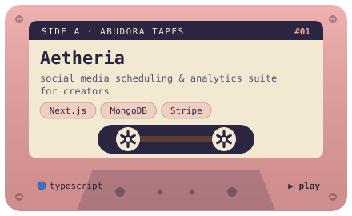</a>
<a href="https://kanzenn.vercel.app">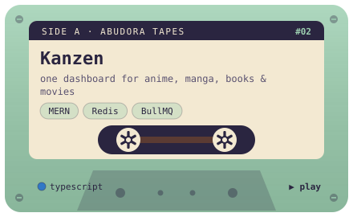</a>
<a href="https://cortexlms.vercel.app/">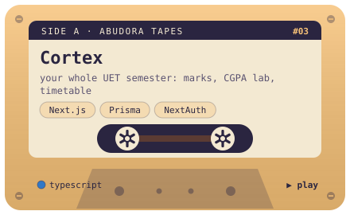</a>
<a href="https://wakaruu.vercel.app/">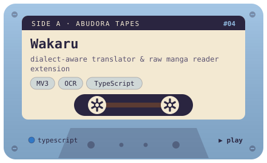</a>
<a href="https://nexus-chatboot.vercel.app">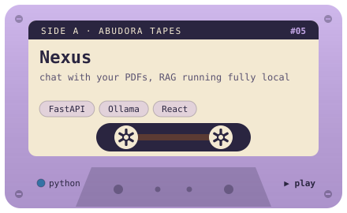</a>
<a href="https://github.com/Abudora-0/Beacon">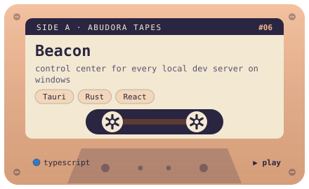</a>
</p>

<details>
<summary><b>🎧 &nbsp;the full mixtape</b> <sub>(36 tracks, auto-updated every few hours)</sub></summary>
<br>

| # | track | liner notes | flavor | listen |
|:-:|:--|:--|:--|:-:|
| 01 | **[Summer-Projects](https://github.com/Abudora-0/Summer-Projects)** | A full stack developer with a shipping problem. Nine products designed, built and deploy… | typescript | [▶ live](https://abudora-summer.vercel.app) |
| 02 | **[Cortex](https://github.com/Abudora-0/Cortex)** | Your whole UET semester in one place: marks & CGPA, a GPA what-if lab, timetable, assign… | typescript | [▶ live](https://cortexlms.vercel.app/) |
| 03 | **[Wakaru](https://github.com/Abudora-0/Wakaru)** | Translator, multilingual dictionary and raw manga reader. Dialect aware, built entirely… | typescript | [▶ live](https://wakaruu.vercel.app/) |
| 04 | **[Bento](https://github.com/Abudora-0/Bento)** | Self-hosted bookmark manager in two pieces: a browser extension that captures tabs as co… | typescript | [▶ live](https://bentto.vercel.app/) |
| 05 | **[Web-Projects](https://github.com/Abudora-0/Web-Projects)** | 40 mini web projects built from scratch - browser games, productivity tools, UI clones a… | javascript | [▶ live](https://abudora-web.vercel.app) |
| 06 | **[Aetheria](https://github.com/Abudora-0/Aetheria)** | Automated social media scheduling and analytics suite for content creators: multi-networ… | typescript | [▶ live](https://aetheriia.vercel.app/) |
| 07 | **[Kanzen](https://github.com/Abudora-0/Kanzen)** | Unified media and cross-platform tracker dashboard for anime, manga, books, and movies.… | typescript | [▶ live](https://kanzenn.vercel.app) |
| 08 | **[Resume-Projects](https://github.com/Abudora-0/Resume-Projects)** | Eight shipped products, eight distinct design languages, one exhibition catalogue. Next.… | typescript | [▶ live](https://abudora-resume.vercel.app) |
| 09 | **[Nexus](https://github.com/Abudora-0/Nexus)** | Document chat app powered by RAG - upload PDFs and ask questions. Runs fully local via O… | css | [▶ live](https://nexus-chatboot.vercel.app) |
| 10 | **[Get-Me-a-Chai](https://github.com/Abudora-0/Get-Me-a-Chai)** | A full-stack creator support platform inspired by Patreon and Buy Me a Coffee. Fans can… | javascript | [▶ live](https://get-me-a-chaii.netlify.app/) |
| 11 | **[Nebula](https://github.com/Abudora-0/Nebula)** | A clean, minimal password manager that runs entirely in your browser. No accounts, no se… | javascript | [▶ live](https://nebuula.vercel.app/) |
| 12 | **[DeLinks](https://github.com/Abudora-0/DeLinks)** | A clean, minimal URL shortener that lets you create custom short links instantly - no ac… | javascript | [▶ live](https://delink.netlify.app/) |
| 13 | **[Tessera](https://github.com/Abudora-0/Tessera)** | A generative wallpaper studio. Draw wallpapers from a seed and export them pixel perfect… | typescript | [▶ live](https://tesseera.vercel.app) |
| 14 | **[Dish-It](https://github.com/Abudora-0/Dish-It)** | An animated recipe kitchen for food, shakes and drinks. Explore by flavor and mood, cook… | typescript | [▶ live](https://dish-itt.vercel.app) |
| 15 | **[Wanderlens](https://github.com/Abudora-0/Wanderlens)** | Spin the globe, pick anywhere on Earth, and discover the best places to visit there. Nex… | typescript | [▶ live](https://wanderlenss.vercel.app) |
| 16 | **[Dossier](https://github.com/Abudora-0/Dossier)** | Kanban board for tracking job applications through every hiring stage, with drag-and-dro… | typescript | [▶ live](https://dosssier.vercel.app/) |
| 17 | **[CODEREVIEW.SYS](https://github.com/Abudora-0/CODEREVIEW.SYS)** | AI-powered code review tool that scores your code and detects bugs, security vulnerabili… | typescript | [▶ live](https://codereview-sys.vercel.app/) |
| 18 | **[DarazSmart](https://github.com/Abudora-0/DarazSmart)** | Shop Daraz.pk smarter - live price comparison, virtual cart, coupon collector, and price… | typescript | [▶ live](https://darazsmart.vercel.app/) |
| 19 | **[Kernal](https://github.com/Abudora-0/Kernal)** | GitHub Dev Dashboard analytics dashboard with contribution graphs, coding streaks, langu… | typescript | [▶ live](https://kernall.vercel.app/) |
| 20 | **[Mern-Projects](https://github.com/Abudora-0/Mern-Projects)** | A showcase of full-stack web applications built with the MERN stack and modern web techn… | html | [▶ live](https://abudora-mern.netlify.app/) |
| 21 | **[Cadence](https://github.com/Abudora-0/Cadence)** | Type to a tempo. A focus-first typing trainer with a live keystroke waveform, a tempo-lo… | typescript | [▶ live](https://cadencce.vercel.app) |
| 22 | **[Deez-Nutz](https://github.com/Abudora-0/Deez-Nutz)** | Deez Nutz: a neo brutalist arcade for downloading the internet's finest memes and gifs.… | typescript | [▶ live](https://deez-nutzz.vercel.app) |
| 23 | **[Linktree-Clone](https://github.com/Abudora-0/Linktree-Clone)** | A full-stack Linktree clone where users can create a personalized page with a custom han… | javascript | [▶ live](https://linkedtreee.netlify.app/) |
| 24 | **[Hidayah](https://github.com/Abudora-0/Hidayah)** | Prayer times, the Hijri calendar and the full Quran in Arabic, English and Urdu with taf… | typescript | [▶ live](https://hidayyah.vercel.app) |
| 25 | **[Morphly](https://github.com/Abudora-0/Morphly)** | Paste raw text or AI-generated output, export a native .docx, .xlsx, or .pptx file. No a… | typescript | [▶ live](https://morphlyy.vercel.app/) |
| 26 | **[Preface](https://github.com/Abudora-0/Preface)** | Dump your project in, get a well organised README out. Local-first README generator with… | typescript | [▶ live](https://prefacee.vercel.app/) |
| 27 | **[Roleify](https://github.com/Abudora-0/Roleify)** | A CV maker where the whole interface changes mood to match your profession. Six role bas… | typescript | [▶ live](https://roleify.vercel.app) |
| 28 | **[Chronos](https://github.com/Abudora-0/Chronos)** | A modern automation console for Windows - run, schedule, and monitor your backup, sync,… | python | · |
| 29 | **[Omnikit](https://github.com/Abudora-0/Omnikit)** | Self-hosted web toolkit - 43 tools for images, PDFs, and utilities processed in-browser,… | typescript | [▶ live](https://omniikit.vercel.app/) |
| 30 | **[iDO](https://github.com/Abudora-0/iDO)** | A focused, distraction-free task manager with priority levels and real-time stats. Built… | javascript | [▶ live](https://ido-it.vercel.app/) |
| 31 | **[Veloci](https://github.com/Abudora-0/Veloci)** | Tauri desktop app for scanning listing pages and batch-downloading videos through a yt-d… | python | · |
| 32 | **[Typeset](https://github.com/Abudora-0/Typeset)** | Zero-setup GitHub portfolio generator. Enter any username and get a beautiful, shareable… | typescript | [▶ live](https://typedset.vercel.app/) |
| 33 | **[Shiori](https://github.com/Abudora-0/Shiori)** | Local-first anime, manga, manhwa and manhua tracker - import from AniList/MyAnimeList/Ki… | typescript | [▶ live](https://shiorii.vercel.app/) |
| 34 | **[Beacon](https://github.com/Abudora-0/Beacon)** | A local dev-server control center for Windows  - scan a folder, and Beacon finds every p… | typescript | · |
| 35 | **[Binge](https://github.com/Abudora-0/Binge)** | A full-stack video streaming web application built with Node.js, Express, EJS, and MySQL… | ejs | · |
| 36 | **[Portfolio](https://github.com/Abudora-0/Portfolio)** | Personal portfolio — editorial ink & paper design.  | html | [▶ live](https://abudora.netlify.app/) |

</details>

<br>

### 🕯️ &nbsp;the cozy corner

<p align="center">
  
  
  
  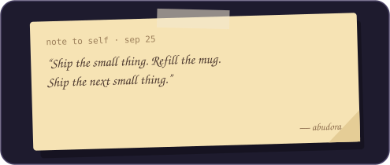
</p>

### 🌙 &nbsp;now brewing

- <code>3h ago</code> ☕ poured **5** commits into [Summer-Projects](https://github.com/Abudora-0/Summer-Projects)
- <code>5h ago</code> ☕ poured **3** commits into [Cortex](https://github.com/Abudora-0/Cortex)
- <code>19h ago</code> ☕ poured **1** commit into [Wakaru](https://github.com/Abudora-0/Wakaru)
- <code>21h ago</code> ☕ poured **2** commits into [Bento](https://github.com/Abudora-0/Bento)
- <code>1d ago</code> ☕ poured **13** commits into [Web-Projects](https://github.com/Abudora-0/Web-Projects)
- <code>2d ago</code> ☕ pushed to [Aetheria](https://github.com/Abudora-0/Aetheria)

<br>

### 📚 &nbsp;on the nightstand

<p align="center">
  <a href="https://anilist.co/user/6107657"></a>
</p>

<br>

### 🌆 &nbsp;the city outside my window

<p align="center">
  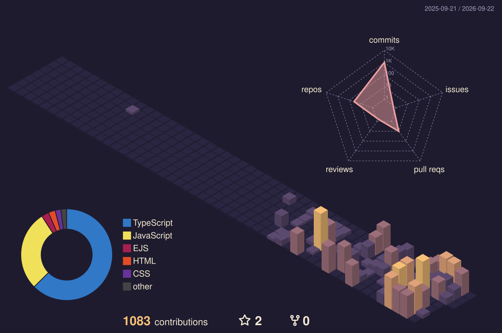
</p>

<p align="center">
  <picture>
    <source media="(prefers-color-scheme: dark)" srcset="https://raw.githubusercontent.com/Abudora-0/Abudora-0/output/github-contribution-grid-snake-dark.svg">
    
  </picture>
</p>

<br>

### 📝 &nbsp;the guestbook fridge

<p align="center">
  <a href="https://github.com/Abudora-0/Abudora-0/issues/new?template=guestbook.yml">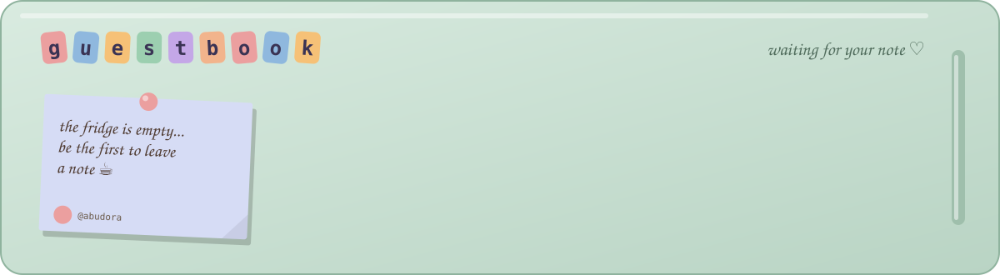</a>
</p>

<p align="center">
  <a href="https://github.com/Abudora-0/Abudora-0/issues/new?template=guestbook.yml"></a>
  <br>
  <sub>say hi, drop a recommendation or leave a tiny doodle in words. your note shows up here within a few minutes ♡</sub>
</p>


<div align="center">


<sub>last brewed at 11:15 am pkt, sep 13, 2026 · the window follows the real time and weather in lahore ☕</sub>

</div>
